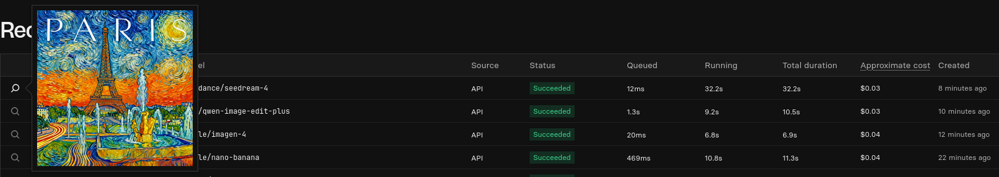

# GIMP na sterydach! 🚀 Jak odpalić edytor z wtyczkami AI w kontenerze Debian?

GIMP to potężne i darmowe narzędzie do edycji grafiki, ale czy wiesz, że możesz go połączyć z mocą sztucznej inteligencji do generowania obrazów bezpośrednio w programie? W tym poradniku pokażę Ci, jak zainstalować najnowszą wersję GIMPa wraz z wtyczką "Dream Prompter" (wykorzystującą Nano Banana Gemini 2.5 Flash Image Preview, Imagen 4, Qwen Image Edit Plus i Seedream 4) wewnątrz kontenera `Distrobox` na Debianie. To idealne rozwiązanie dla użytkowników Steam Decka i nie tylko!

## Dlaczego `apt`, a nie Flatpak?

Początkowo planowałem użyć Flatpaka, aby zdobyć najnowszą wersję GIMPa, ale okazało się, że repozytoria Debiana "Trixie" (których używa nasz kontener) oferują już wersję **3.0.4**! To upraszcza sprawę i pozwala nam uniknąć potencjalnych problemów z Flatpakiem wewnątrz kontenera.

## Krok 1: Instalacja GIMPa i podstawowych narzędzi

Zaczynamy od zainstalowania GIMPa, `git` (do pobrania wtyczki) i `python3-pip` (do instalacji jej zależności). Wszystko w jednej komendzie wewnątrz naszego kontenera `debian`:

```bash
distrobox enter debian -- sudo apt-get install -y gimp git python3-pip
```

## Krok 2: Pobranie wtyczki Dream Prompter

Teraz, gdy mamy już niezbędne narzędzia, klonujemy repozytorium wtyczki prosto z GitHuba.

```bash
distrobox enter debian -- git clone https://github.com/zquestz/dream-prompter.git
```

## Krok 3: Instalacja zależności wtyczki (Python)

Wtyczka potrzebuje biblioteki `replicate` do komunikacji z AI. Zainstalujemy ją za pomocą `pip`. Uwaga: nowsze wersje Debiana chronią systemowe pakiety Pythona. Użyjemy flagi `--break-system-packages`, aby świadomie zainstalować pakiet w tym środowisku kontenerowym, gdzie ryzyko jest minimalne.

```bash
distrobox enter debian -- pip install replicate --break-system-packages
```

## Krok 4: Umieszczenie wtyczki w folderze GIMPa

Musimy przenieść pobrane pliki wtyczki do folderu, w którym GIMP szuka swoich rozszerzeń.

Najpierw stwórzmy ten folder, jeśli jeszcze nie istnieje:

```bash
distrobox enter debian -- mkdir -p ~/.config/GIMP/3.0/plug-ins/
```

A następnie przenieśmy tam wtyczkę:

```bash
distrobox enter debian -- mv dream-prompter ~/.config/GIMP/3.0/plug-ins/
```

## Krok 5: Nadanie uprawnień do wykonania

To ostatni i kluczowy krok techniczny. Musimy oznaczyć główny plik wtyczki jako wykonywalny, aby GIMP mógł go uruchomić.

```bash
distrobox enter debian -- chmod +x ~/.config/GIMP/3.0/plug-ins/dream-prompter/dream-prompter.py
```

## Finał: Uruchomienie i konfiguracja

To wszystko! Teraz wystarczy uruchomić GIMPa. W menu **Filtry -> AI** powinna pojawić się nowa opcja **Dream Prompter**.

**Ważna uwaga:** Przy pierwszym uruchomieniu wtyczka poprosi Cię o **klucz Replicate API**. Jest on niezbędny do jej działania.

**Klucz Replicate API** storzysz na stronie <https://replicate.com/account/api-tokens>

Wszystko ładnie zacznie działać jak zasilisz konto, **minimalna wpłata 10$**



Teraz możesz cieszyć się potęgą generatywnej AI bezpośrednio w swoim ulubionym edytorze grafiki!


<br/>
<button onClick={() => alert("Dziękuję za przeczytanie artykułu o GIMPie z AI! 👍")}>
  Eksperymentuj z mocą AI w GIMPie i twórz niesamowite grafiki! Do zobaczenia w następnym wpisie! 🧙‍♂️🌟
</button>
